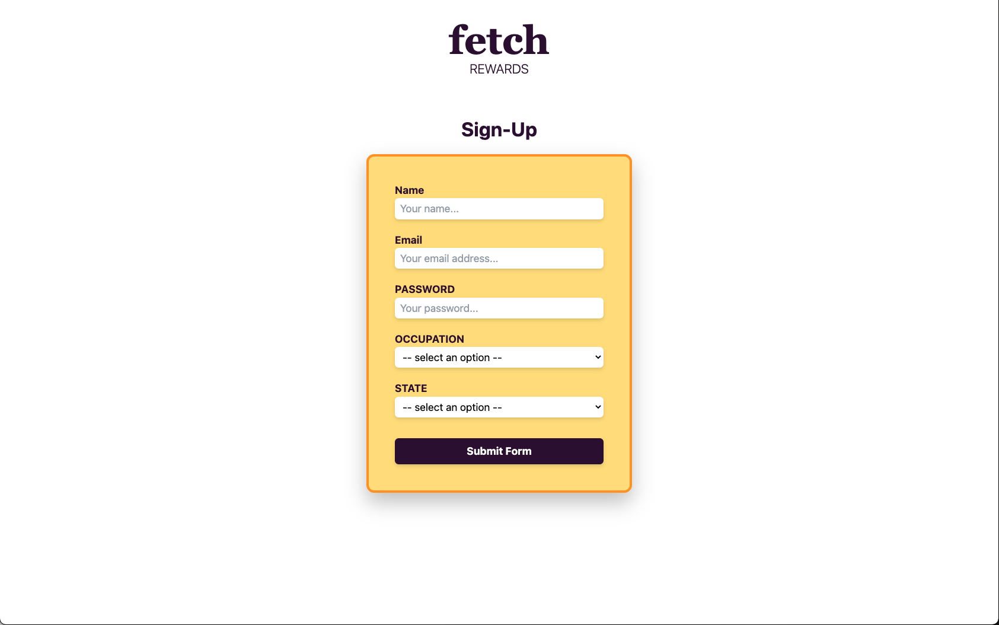

# FR_Exercise

Express & Liquid were used since using lightweight frameworks seems better for this assignment. 

## Dependencies
install =>
- npm init
- npm install express
- npm install liquid-express-views
- npm i nodemon

to start =>
- nodemon start

go to => 
http://localhost:3000/

## Screenshots

## Technologies used
- express 
- Javascript 
- liquid JS 
- Tailwind 